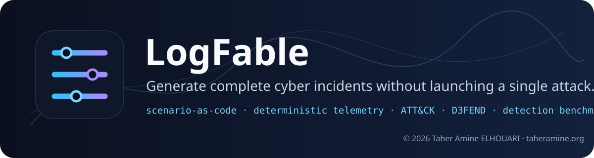
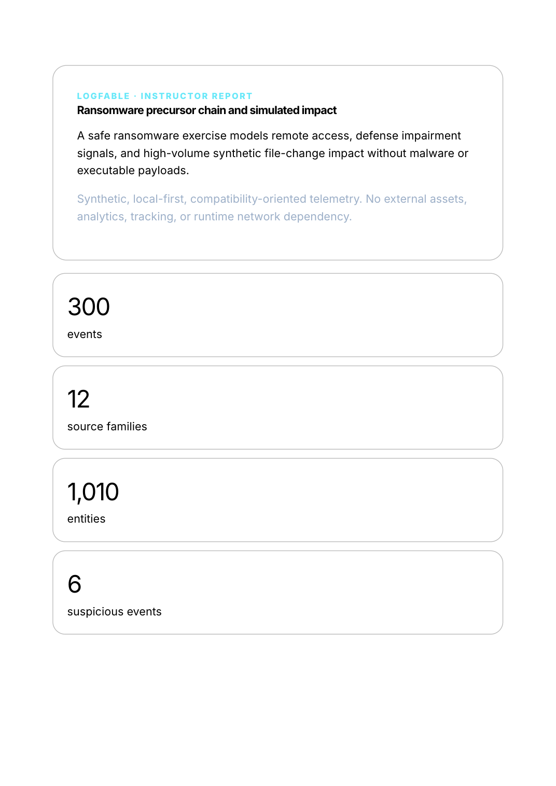
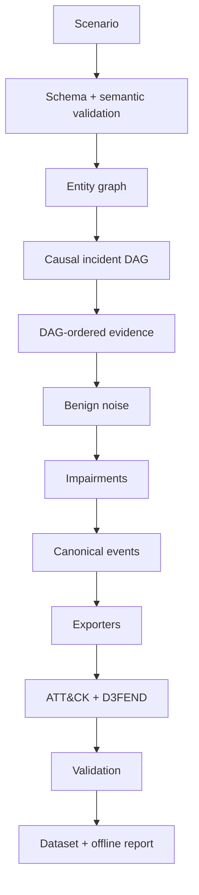

<p align="center"></p>

# LogFable

**Generate complete cyber incidents without launching a single attack.**

**Created and maintained by Taher Amine ELHOUARI**  
© 2026 Taher Amine ELHOUARI · [taheramine.org](https://www.taheramine.org) · [GitHub @MrTaherAmine](https://github.com/MrTaherAmine)

LogFable is a local-first scenario-as-code engine that generates deterministic, causally coherent, multi-source **synthetic cybersecurity telemetry** for SOC training, detection engineering, SIEM validation, cyber ranges, research, education, and defensive-product testing.

It creates an incident *story*, not a bag of unrelated random logs: stable identities and assets, a causal timeline, benign activity, cross-source suspicious evidence, telemetry impairments, separated ground truth, ATT&CK/D3FEND mappings, investigation questions, and benchmarkable detection expectations.

## 60-second quick start

```bash
python3 -m venv .venv
source .venv/bin/activate
python -m pip install .
logfable about
logfable scenarios list
logfable generate ransomware-enterprise \
  --duration 6h --users 500 --noise 98 --seed 2026 \
  --formats generic-jsonl,ecs,ocsf,cef \
  --student-package --instructor-package \
  --output ./lab
logfable validate ./lab
logfable inspect ./lab --report
```

The bundled quick-start configuration is designed to generate locally without an account, API key, paid service, LLM, or network connection.

## What it is / what it is not

**It is:** deterministic defensive simulation, synthetic telemetry, scenario-as-code, training packaging, mapping provenance, and detection benchmarking.

**It is not:** malware, exploit tooling, attack automation, a hosted service, a SIEM transmitter, proprietary vendor log cloning, or proof that a control/detection works universally.

## Built-in scenarios

1. Password spray → account takeover
2. Business email compromise + mailbox rule persistence
3. OAuth consent abuse + cloud identity persistence
4. Ransomware precursor chain + simulated impact
5. Cloud access-token theft + object-storage exfiltration
6. Compromised administrator + destructive cloud changes
7. Insider staging + exfiltration
8. Web application compromise + **synthetic** web-shell activity
9. Kubernetes service-account compromise + cluster discovery
10. CI/CD / software supply-chain compromise
11. Hybrid endpoint-to-cloud identity attack
12. IT-to-OT lateral-movement investigation using passive synthetic evidence
13. MFA fatigue followed by deterministic session takeover
14. Privileged credentials used from an unusual location
15. Help-desk recovery abuse followed by identity takeover
16. Synthetic business-application data manipulation
17. SaaS mass download followed by suspicious sharing
18. Cloud IAM privilege escalation with rollback evidence
19. Mobile-device identity anomaly with MDM correlation
20. Session-artifact exposure represented only through safe endpoint/identity telemetry
21. Kubernetes secret access + workload-identity misuse
22. CI runner-token misuse + artifact provenance drift
23. Credential stuffing correlated across WAF, application, and identity telemetry
24. Removable-media staging with DLP + endpoint evidence
25. DNS-tunneling-like metadata anomaly without operational payloads
26. VPN-to-RDP remote-access compromise with administrator lookalikes
27. Backup-control-plane tampering before simulated ransomware impact
28. IT/OT vendor remote-access misuse using passive metadata only

All 28 scenarios ship in **LogFable v1.0.0**. Every bundled scenario includes correlated sources, a benign lookalike, investigation questions, scoring, ATT&CK mapping rationale, D3FEND opportunities, and deterministic behavior.

## Telemetry families

Endpoint/OS · identity/SaaS · DNS/proxy/firewall/VPN/DHCP/NetFlow/Zeek-inspired metadata · AWS/Azure/GCP-style control-plane activity · NGINX/Apache/WAF/API/database/object storage · email · Kubernetes/container/registry/Git/CI/CD · passive metadata-only OT/ICS sources.

Vendor-inspired source families are explicitly **synthetic and compatibility-oriented**. In v1.0, `telemetry/source/<family>/events.jsonl` is a canonical analyst-visible JSONL partition tagged with the relevant source family/product profile; it is **not** a native EVTX, CloudTrail wire-schema clone, or byte-perfect proprietary log serializer. Native/normalized serialization is provided only for the formats listed below. LogFable does not claim byte-perfect parity with proprietary telemetry.

## Formats

Canonical JSON · JSONL/NDJSON · CSV · RFC5424-style syslog · CEF · LEEF · **ECS 9.4.0** · **OCSF 1.8.0** · OpenTelemetry Logs · Splunk HEC-compatible files · Elasticsearch bulk files · optional Parquet.

Each normalized export records its lossy-mapping notes in `reports/quality.json`; the run manifest records the pinned ECS and OCSF schema baselines.

## ATT&CK 19.2 + D3FEND 1.5.0

LogFable pins framework versions in every run. The bundled offline indexes are compact validation indexes covering the framework objects referenced by the shipped scenarios; they are not redistributed copies of the complete ATT&CK/D3FEND knowledge bases. `logfable knowledge update attack` explicitly downloads the official current ATT&CK STIX 2.1 bundles and accepts them only when their embedded collection version is exactly 19.2. Generation itself never needs that network update. D3FEND refresh verification is likewise explicit and version-pinned. ATT&CK records include technique, tactic, step, rationale, evidence sources, confidence, provenance, and review state. Verified Detection Strategy/Analytic/Data Component references are included where curated. D3FEND mappings preserve mapping type and confidence and never turn inferred relationships into mitigation guarantees.

Generated mapping artifacts include:
- `mappings/attack.json`
- `mappings/attack-navigator-layer.json`
- `mappings/d3fend.json`
- `mappings/attack-d3fend-crosswalk.csv`

## Detection benchmarking

```bash
logfable benchmark --dataset ./lab --alerts ./my-alerts.json
```

The v1.0 matcher accepts JSON, JSONL/NDJSON, and CSV and can correlate alerts by event ID, correlation ID, scenario step, ATT&CK technique, or user/host plus an optional time window. It produces TP/FP/FN, precision, recall, F1, time-to-detect, technique/step/source coverage, and false-positive performance against known benign lookalikes. It also writes `reports/benchmark.json` and `reports/benchmark.md`. Benchmark results are evidence for that dataset/configuration—not universal proof of coverage.

## Student and instructor workflows

`--student-package` removes the resolved attack scenario, framework mapping bundle, ground truth, answers, and instructor counts, then rewrites checksums and the offline report. `--instructor-package` preserves the full evidence index, mappings, answers, rubric, timeline, and detection opportunities.

Labeled research exports are intentionally incompatible with student packages.

## Dataset tree

```text
lab/
├── manifest.json
├── scenario/resolved-scenario.yaml
├── environment/{organization,entities,relationships}.json
├── telemetry/{canonical,source,normalized}/
├── mappings/{attack.json,attack-navigator-layer.json,d3fend.json,attack-d3fend-crosswalk.csv}
├── training/{student-brief.md,questions.json}
├── instructor/{ground-truth.json,timeline.csv,answers.json,scoring-rubric.json,detection-opportunities.json}
├── reports/{report.html,summary.md,quality.json}
└── checksums.sha256
```

## Offline report

The report is a single self-contained HTML file: no server, CDN, tracking, external CSS/JS, or runtime network dependency.



## Architecture



See [`docs/architecture.md`](docs/architecture.md), [`docs/threat-model.md`](docs/threat-model.md), and [`docs/dataset-formats.md`](docs/dataset-formats.md). For pre-publication macOS validation, use [`docs/mac-testing.md`](docs/mac-testing.md).

**v1.0 modeling boundary:** the engine enforces deterministic DAG ordering, step timing, correlated identifiers, seeded optional-step probability, and deterministic telemetry impairments. `state_changes`, `actor`, and `target` are present in the scenario model, but v1.0 does not yet implement a general mutable world-state/precondition engine or rich entity-selector resolution; scenarios are authored so their emitted evidence remains coherent within those limits.

## Reproducibility

The same LogFable release + scenario version + knowledge versions + configuration + seed + concurrency mode produces deterministic semantic output. Different seeds change safe indicators/timing/branches while preserving scenario intent. Future engine releases may intentionally change output unless a compatibility mode states otherwise.

## Safety guarantees

Generation performs no outbound network request. Bundled content uses fictitious identities, `.example` domains, private/documentation IP ranges, and inert placeholders. LogFable contains no malware, exploit, credential-stealing routine, operational phishing kit, destructive command, persistence payload, or OT control command. Explicit `knowledge update` is the only core operation intended to access the network.


## EvidenceVeil interoperability direction

LogFable remains independently usable and has **no runtime dependency on EvidenceVeil**. Its canonical JSONL event envelope, manifest, checksums, source-family partitions, and student/instructor separation provide a stable future handoff surface for EvidenceVeil to sanitize or transform generated evidence without coupling the two projects. Any future integration should consume these documented files/contracts rather than import LogFable internals.

## Contributor experience

```bash
logfable scenarios scaffold my-scenario
logfable scenarios validate ./scenarios
logfable plugins list
```

Start with [`CONTRIBUTING.md`](CONTRIBUTING.md), the [scenario authoring guide](docs/scenario-authoring.md), and [plugin guide](docs/plugin-development.md).

## Performance

The current Mac-readiness audit smoke generated 100,022 events in 20.61 seconds on the Linux/CPython 3.13.5 audit environment. Peak RSS was about 678 MiB because the core engine still retains the canonical event list in memory; text exporters themselves stream. Hardware and filesystem performance vary. See [`docs/performance.md`](docs/performance.md).

## Development

```bash
python -m pip install -e ".[dev]"
pytest --cov=logfable --cov-branch
ruff check .
mypy src/
python -m build
twine check dist/*
```

CI is configured to cover Linux, macOS, Windows, Python 3.11–3.14, scenario generation, security scanning, packaging, and deterministic sample generation. Python 3.14 is the latest stable branch at the v1.0.0 release date.

## Citation, license, maintainer

Apache License 2.0. See `LICENSE`, `NOTICE`, and `CITATION.cff`.

<p align="center">
  <strong>LogFable</strong><br>
  Created and maintained by <strong>Taher Amine ELHOUARI</strong><br>
  © 2026 Taher Amine ELHOUARI<br>
  <a href="https://www.taheramine.org">taheramine.org</a> ·
  <a href="https://github.com/MrTaherAmine">GitHub @MrTaherAmine</a>
</p>
