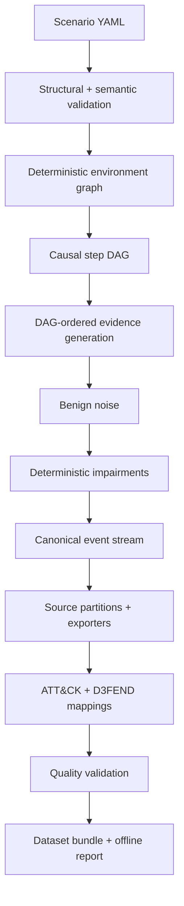

# Architecture

LogFable is a typed local pipeline. Generation does not call the network.

## Module boundaries
- `models.py`: public typed contracts.
- `scenarios.py`: safe YAML loading and semantic validation.
- `environment.py`: stable entity/relationship graph.
- `engine.py`: causal plan, deterministic event and noise generation.
- `exporters.py`: compatibility-oriented serialization.
- `mappings.py`: evidence-linked framework records.
- `dataset.py`: atomic package assembly and archive separation.
- `validate.py`: checksum, leakage, mapping, and indicator validation.
- `benchmark.py`: alert import and metrics.
- `update.py`: explicit, TLS-verified official knowledge downloads.

v1.0 uses a bounded compact-event implementation for typical labs; the API is organized so v1.1 can replace the in-memory list with partitioned streaming writers while preserving public contracts.
